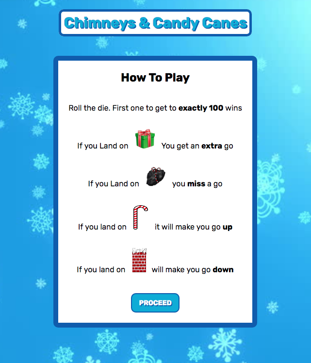

# WDI-Project-1
<h2>What is Chimneys & Candy Canes?</h2>

For my first WDI project, I was tasked to build a Front end JavaScript game. Since it was the holiday season, I decided to make a festive version of snakes and ladders which utilised all the fundamental concepts of JavaScript such as (but not limited to)  functions, arrays, loops and objects.

<h2>How to Use</h2>

Lucky for you, when you first load up the app, you will be greeted with a set of instructions on how to play the game.

From here you can choose the character you want to play, wether it be Elf or Santa.

Once you have picked your character, the game will load and you will be able to click the die at the bottom. This will generate a random number from 1 - 6 and move your player to the appropriate square. The computers turn will be executed shortly after.

The first character to get to <i>exactly</i> 100 wins!

<h2>Technologies Used</h2>
<ul>
  <li>HTML5</li>
  <li>CSS3</li>
  <li>JavaScript (ES6)</li>
  <li>jQuery</li>
  <li>Git</li>
  <li>Github</li>
</ul>

<h2>Wins</h2>
This has probably been the most fun app that I have made during WDI, due to the creative freedom given. I was pleased with what I was able to make given a week and was particularly proud of the logic I was able to implement in terms of continually keeping track of each characters score and altering it according to the special square types they land on.

<h2>Challenges</h2>
The main challenges I faced with this project, have been on the design end. Unfortunately, I was unable to make this application fully responsive as the grid would not be able to fit adequately on mobile devices.

<h2>Future improvements</h2>
If I could improve this app, I would add a mute button to allow users to turn off the music which could potentially get jarring. Additionally, I would also like to add animations to make the characters actually move from square to square rather than 'teleporting' to their target square.

<a href="https://fierce-sea-12566.herokuapp.com/">Click Here to launch the app In Heroku</a>
